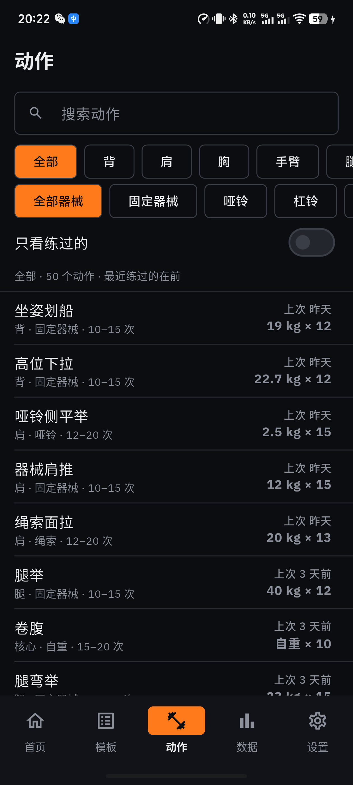
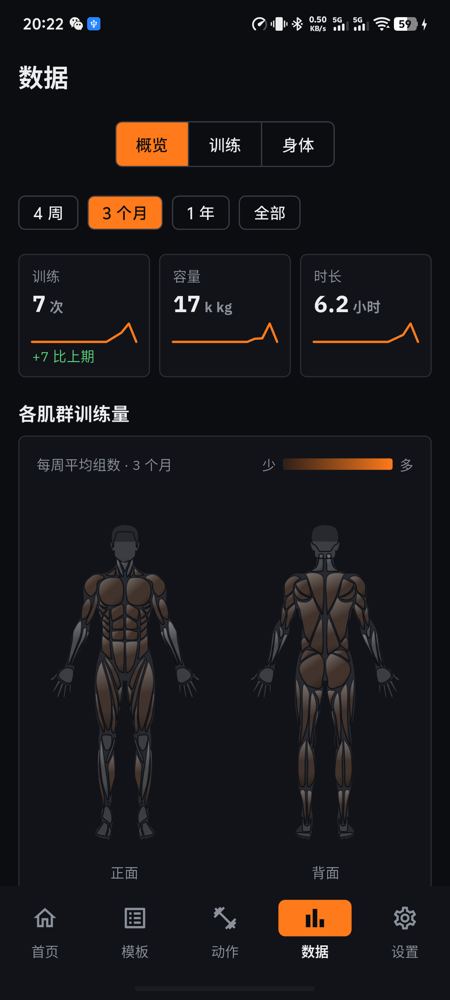
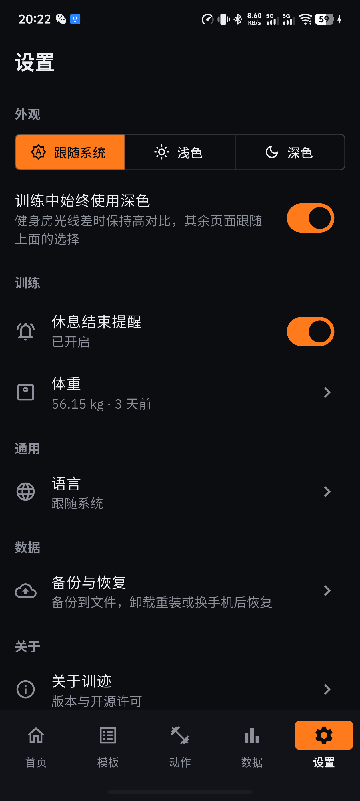
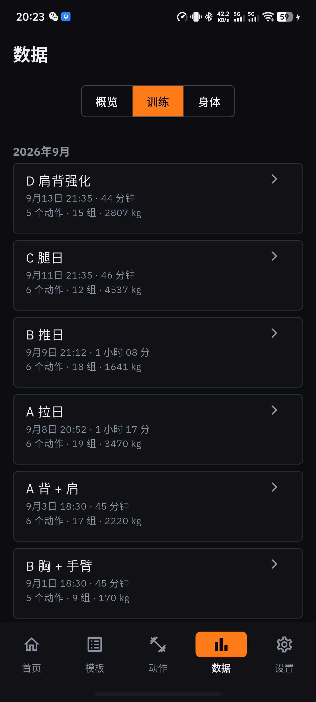
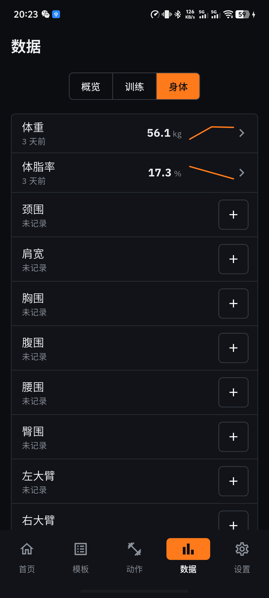
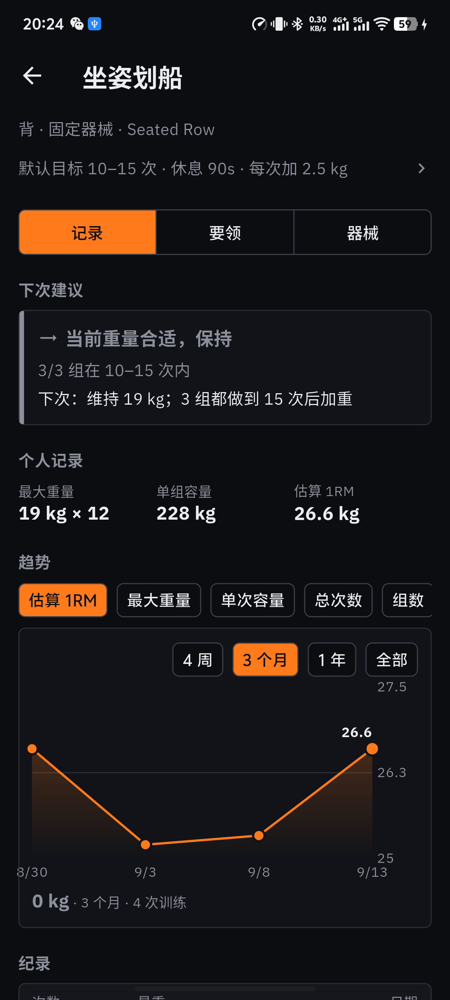
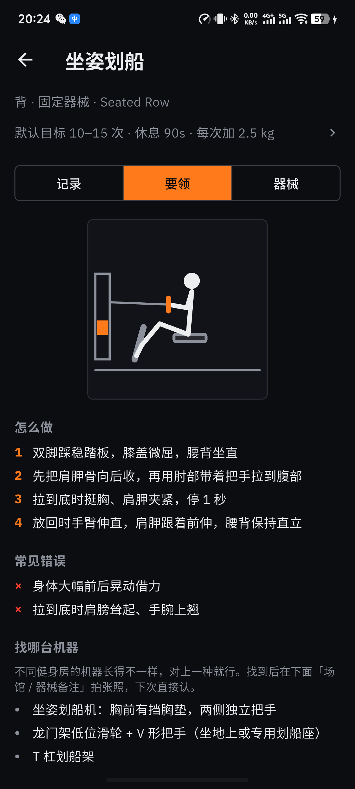

# TrainTrace · 训迹

力量训练记录 App，支持训练模板、动作库、数据趋势与身体测量，并根据训练记录提供重量调整建议。

## 截图

| 首页 | 模板 | 动作 |
| :---: | :---: | :---: |
|  |  |  |

| 数据 · 概览 | 设置 |
| :---: | :---: |
|  |  |

| 训练 | 身体 |
| :---: | :---: |
|  |  |

| 记录 | 要领 | 器械 |
| :---: | :---: | :---: |
|  |  |  |
